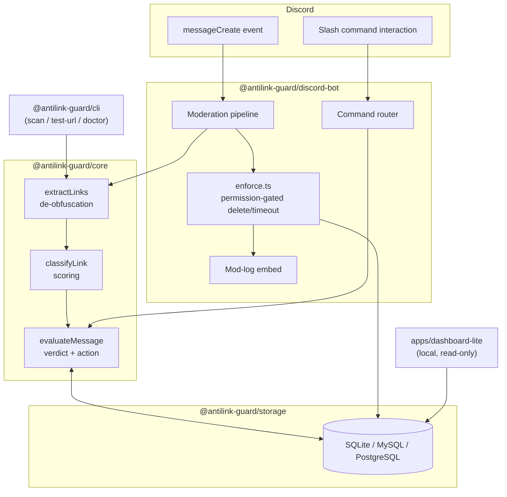

<div align="center">

# AntiLink Guard OSS

**Open-source Discord anti-phishing and link moderation framework.**

[](./LICENSE)
[](https://nodejs.org)
[](https://discord.js.org)
[](https://pnpm.io)
[](https://www.typescriptlang.org)
[](https://github.com/timeout187/AntiLink-Guard-OSS/actions/workflows/ci.yml)
[](https://github.com/timeout187/AntiLink-Guard-OSS/actions/workflows/codeql.yml)
[](./CONTRIBUTING.md)

**A real detection and policy engine for Discord link moderation - self-hosted,
open-source, and yours to run, read, and modify.**

[Quick start](#quick-start) ·
[Features](#features) ·
[Architecture](#architecture) ·
[Docs](./docs) ·
[Roadmap](./ROADMAP.md)

</div>

---

## The problem

Discord communities get hit with the same handful of attacks constantly:
phishing links dressed up as free-Nitro giveaways, scam Discord invites,
punycode/homoglyph domains that look identical to legitimate ones at a
glance, and links deliberately obfuscated (`hxxps://`, `example[.]com`,
zero-width characters) to slip past naive keyword filters. Most
self-hostable anti-link bots do a plain `.includes("http")` check and call
it done.

|                   | Naive keyword bot                                 | AntiLink Guard OSS                                             |
| ----------------- | ------------------------------------------------- | -------------------------------------------------------------- |
| Detection         | Substring match on `http`                         | Real link extraction: markdown, bare `www.`, Discord invites   |
| Obfuscation       | Bypassed by `hxxps://`, `[.]`, zero-width chars   | De-obfuscated before scoring                                   |
| Lookalike domains | Not detected                                      | Punycode + Latin/Cyrillic/Greek homoglyph checks               |
| Decision          | Binary: delete or ignore                          | Scored verdict (`ALLOW`/`WARN`/`BLOCK`/`QUARANTINE`)           |
| Enforcement       | Fixed                                             | Configurable ladder: `log → warn → delete → timeout`           |
| Failure mode      | Crashes or silently no-ops on missing permissions | Checks permissions first, fails safe, logs why                 |
| Message content   | Often logged in full                              | Audit log type has no field that can hold it                   |
| Extensibility     | Fork the script                                   | Typed packages: swap storage, embed the engine, script the CLI |

## Features

Everything below is implemented and tested in this repository:

- 🔗 **Real link detection** - not just `https?://`. Catches markdown
  links, bare `www.` domains, Discord invites, and links deliberately
  obfuscated with `hxxp://`, `example[.]com`, or zero-width characters.
- 🕵️ **Classification, not just matching** - domain allow/blocklists, a
  guild-suppliable known-phishing list, common URL shorteners, punycode
  hostnames, and Latin/Cyrillic/Greek homoglyph mixing, plus your own
  custom regex rules.
- ⚖️ **A real policy engine** - every message gets a score and one of four
  verdicts (`ALLOW`/`WARN`/`BLOCK`/`QUARANTINE`), mapped to an action
  through a `log → warn → delete → timeout` enforcement ladder you control
  per server.
- 🔐 **Permission-safe by construction** - the bot checks its own Discord
  permissions before every delete/timeout and fails safe (logs and skips)
  rather than crashing or assuming success.
- 🗄️ **Your database, your choice** - memory (for tests), SQLite (the
  self-hosting default), MySQL, or PostgreSQL, all behind one interface.
- 📊 **Metadata-only audit logging** - the audit log type has no field
  capable of holding message content, by design. See
  [`docs/privacy.md`](./docs/privacy.md).
- 🧰 **A real CLI** - `antilink scan`/`test-url` run the exact same engine
  the bot uses, entirely offline, no Discord connection required.
- 🖥️ **A minimal local dashboard** - read-only, unauthenticated by design,
  meant for `localhost` (see [`apps/dashboard-lite`](./apps/dashboard-lite)).

No hardcoded "known phishing domain" database is bundled anywhere in this
codebase - that data is always something you (or a feed you choose) supply.
See [`docs/rules-engine.md`](./docs/rules-engine.md#why-knownphishingdomains-is-always-empty-out-of-the-box).

## Architecture



`packages/core` has no dependency on Discord or on any storage backend -
it's a pure detection/policy library you can use standalone (the CLI does
exactly that). See [`docs/rules-engine.md`](./docs/rules-engine.md) for the
full pipeline and [`docs/api-reference.md`](./docs/api-reference.md) for
every package's exports.

## Quick start

```bash
git clone https://github.com/timeout187/AntiLink-Guard-OSS.git
cd AntiLink-Guard-OSS
pnpm install
pnpm run build

cp apps/example-bot/.env.example apps/example-bot/.env
# edit apps/example-bot/.env: DISCORD_TOKEN, DISCORD_CLIENT_ID

pnpm --filter @antilink-guard/example-bot run register-commands
pnpm --filter @antilink-guard/example-bot run start
```

Full walkthrough (Discord Developer Portal setup, required permissions,
Message Content Intent): [`docs/getting-started.md`](./docs/getting-started.md).

### Docker Compose

```bash
cp apps/example-bot/.env.example apps/example-bot/.env
docker compose up --build -d
```

Builds the whole workspace inside the container and runs the bot under a
non-root user, with a persistent volume for its SQLite database. See
[`docs/self-hosting.md`](./docs/self-hosting.md) for switching to MySQL or
PostgreSQL instead.

## Usage

```
/antilink enable
/antilink mode block

/allowlist add domain:cdn.example.com
/blocklist add domain:free-nitro-gift.ru

/invites block-all enabled:true
/invites allow invite:https://discord.gg/your-partner-server

/logs set-channel channel:#mod-log

/testlink url:https://xn--e1aybc.xn--p1ai
/config export
```

Every admin command requires **Manage Server**; `/testlink` is open to
everyone. Full reference: [`docs/configuration.md`](./docs/configuration.md).

Prefer the command line? The exact same engine, no Discord required:

```bash
antilink scan "check out hxxps://free-nitro[.]ru/claim"
antilink test-url https://bit.ly/abc123
antilink doctor
```

## Privacy & security

- **No telemetry.** This project doesn't phone home anywhere.
- **Metadata-only audit logs** - see [`docs/privacy.md`](./docs/privacy.md)
  for exactly what's stored (and what deliberately isn't).
- **Threat model**: [`docs/threat-model.md`](./docs/threat-model.md) - what
  this framework does and doesn't defend against.
- **Reporting a vulnerability**: see [`SECURITY.md`](./SECURITY.md) -
  please don't open a public issue for security problems.

## Repository layout

```
apps/
  example-bot/      a working self-hosted bot built on the packages below
  dashboard-lite/    a local, read-only dashboard
packages/
  core/              URL/invite extraction, classification, policy engine
  storage/           memory / SQLite / MySQL / PostgreSQL adapters
  discord-bot/       the discord.js v14 adapter + moderation pipeline
  cli/               the `antilink` command-line tool
docs/                the guides linked throughout this README
```

## Contributing

Contributions are welcome - see [`CONTRIBUTING.md`](./CONTRIBUTING.md) for
the development setup (pnpm workspace, build order, testing) and
[`CODE_OF_CONDUCT.md`](./CODE_OF_CONDUCT.md). Governance model:
[`GOVERNANCE.md`](./GOVERNANCE.md).

## Roadmap

See [`ROADMAP.md`](./ROADMAP.md) for what's shipped, what's next, and what's
explicitly out of scope for this project.

## License

[MIT](./LICENSE).

## Background

AntiLink Guard OSS is based on lessons learned from running AntiLink, a
Discord moderation bot used across 100+ servers. This repository extracts
the reusable moderation, URL detection, and policy engine into a
self-hostable open-source toolkit for the community.

This repository contains **only** the open-source framework described
above. It is not affiliated with, and does not include, any hosted or
commercial product that happens to share part of its name.
