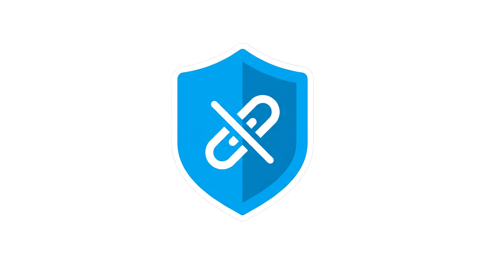

<div align="center">



# AntiLink

**Open-source Discord link moderation for communities that need clean, safe chat.**

[](./LICENSE)
[](https://nodejs.org)
[](https://discord.js.org)
[](https://github.com/timeout187/Anti-Links-Discord-Bot/actions/workflows/ci.yml)
[](./CONTRIBUTING.md)
[](./CODE_OF_CONDUCT.md)

[Website][website] · [Documentation][docs] · [Discord][discord] · [Report a Bug][issues] · [Request a Feature][issues]

</div>

---

> **Note on scope.** This repository is the **community / open-source edition** of AntiLink. It contains the self-hostable Discord bot only. Commercial features, hosted infrastructure, billing, and proprietary detection systems are maintained separately and are **not** part of this repository. Anything on the [Roadmap](#roadmap) marked *Planned* does not exist here yet — it is stated as direction, not as a shipped feature.

## Table of Contents

- [Introduction](#introduction)
- [Features](#features)
- [Architecture](#architecture)
- [Installation](#installation)
- [Quick Start](#quick-start)
- [Commands](#commands)
- [Configuration](#configuration)
- [Screenshots](#screenshots)
- [Roadmap](#roadmap)
- [Contributing](#contributing)
- [Security](#security)
- [License](#license)
- [Support](#support)
- [Documentation](#documentation)
- [FAQ](#faq)

## Introduction

**AntiLink** is a lightweight, self-hostable Discord bot that automatically detects and removes messages containing links in the channels you choose. It was originally built to keep a busy community's general chat free of unwanted and malicious links, and it is now maintained as the open-source foundation of the wider **AntiLink** moderation platform.

The open-source bot is intentionally small and easy to audit: you can read the whole thing, host it yourself, and know exactly what it does with your server's messages.

The broader AntiLink platform (hosted dashboard, analytics, AI-assisted detection, and verification) is a separate product line. See the [Roadmap](#roadmap) for how the open-source bot fits into that picture.

## Features

Currently implemented in this repository:

- 🔗 **Automatic link detection** — scans messages in configured channels and removes those containing links.
- ✅ **Channel whitelisting** — designate channels where links are always allowed.
- 🛡️ **Role-based bypass** — members with configured roles (e.g. staff/mods) are exempt from filtering.
- 📣 **Webhook notifications** — report removals/actions to a channel via a Discord webhook (`WEBHOOK_URL`).
- 🪶 **Minimal footprint** — plain Node.js + discord.js, no database required to get started.

> If you spot a discrepancy between this list and the actual code, it's a bug in the docs — please [open an issue][issues]. We keep this section limited to behavior that actually ships.

## Architecture

The open-source bot follows a simple, single-process design:

```
┌─────────────────────────────────────────────┐
│                Discord Gateway               │
└───────────────────────┬─────────────────────┘
                        │  message events
                        ▼
┌─────────────────────────────────────────────┐
│                 AntiLink Bot                 │
│                                              │
│  ┌────────────┐   ┌───────────────────────┐  │
│  │  Config /  │──▶│   Message Handler      │  │
│  │   .env     │   │  (link detection,      │  │
│  └────────────┘   │   whitelist + bypass)  │  │
│                   └───────────┬───────────┘  │
│                               │ action        │
│                               ▼               │
│                   ┌───────────────────────┐  │
│                   │  Moderation actions    │  │
│                   │  (delete message)      │  │
│                   └───────────┬───────────┘  │
│                               │ notify        │
│                               ▼               │
│                   ┌───────────────────────┐  │
│                   │  Webhook logger        │  │
│                   └───────────────────────┘  │
└─────────────────────────────────────────────┘
```

Slash-command administration is *Planned* (see [Roadmap](#roadmap)); today the
bot is driven entirely by the message-event path shown above plus environment
configuration.

**Design principles**

- **Self-contained.** Runs as a single Node.js process; no external database required for core filtering.
- **Auditable.** Small enough to read end-to-end before you trust it in your server.
- **Configuration over code.** Secrets live in `.env`; behavior is driven by configuration (see [Configuration](#configuration)).

> The commercial AntiLink platform uses a different, service-oriented architecture (dashboard, API, and proprietary detection) that is **not** included here.

## Installation

### Prerequisites

- [Node.js](https://nodejs.org) **18 or newer** and npm
- A Discord bot application and token — see [Discord's developer docs](https://discord.com/developers/docs/quick-start/getting-started)
- The bot must be invited to your server with permission to **Read Messages/View Channels**, **Manage Messages**, and (if you use webhook logging) a webhook in your log channel

### Steps

```bash
# 1. Clone the repository
git clone https://github.com/timeout187/Anti-Links-Discord-Bot.git
cd Anti-Links-Discord-Bot

# 2. Install dependencies
npm install

# 3. Create your environment file
cp .env.example .env
#    then edit .env and fill in your values

# 4. Start the bot
npm start
```

## Quick Start

1. **Create a bot** in the [Discord Developer Portal](https://discord.com/developers/applications), copy its **token**, and enable the **Message Content Intent** under *Bot → Privileged Gateway Intents*.
2. **Invite the bot** to your server with the permissions listed above.
3. **Create a webhook** in the channel where you want moderation logs, and copy its URL (optional but recommended).
4. Fill in `.env`, including your whitelisted channels and bypass roles (see [Configuration](#configuration)):

   ```dotenv
   DISCORD_TOKEN=your-bot-token-here
   WEBHOOK_URL=https://discord.com/api/webhooks/xxx/yyy
   WHITELISTED_CHANNEL_IDS=123456789012345678,234567890123456789
   IGNORED_ROLE_IDS=345678901234567890
   ```

5. Run `npm start`. Post a link in a filtered channel from a non-exempt account to confirm it's removed.

## Commands

The community edition currently has **no slash commands** — it runs entirely as
**automatic message filtering**, configured through environment variables.

| Capability | Status | Description |
| ---------- | ------ | ----------- |
| Automatic link filtering | ✅ Available | Deletes any message containing an `http(s)://` link, unless the channel is whitelisted or the author has a bypass role. Runs continuously; no command needed. |
| Webhook moderation log | ✅ Available | Posts a note to your log webhook each time a message is removed. |
| `/antilink …` slash commands | 🗓️ Planned | Slash-command administration (status, whitelist, bypass management) is on the [Roadmap](#roadmap) and does not exist yet. |


## Configuration

Secrets are provided through environment variables (`.env`). Copy `.env.example` to `.env` and fill in:

| Variable | Required | Description |
| -------- | -------- | ----------- |
| `DISCORD_TOKEN` | ✅ | Your Discord bot token. |
| `WEBHOOK_URL` | Optional | Discord webhook URL for moderation logs. Omit to disable webhook logging. |
| `WHITELISTED_CHANNEL_IDS` | Optional | Comma-separated channel IDs where links are always allowed. |
| `IGNORED_ROLE_IDS` | Optional | Comma-separated role IDs whose members bypass link filtering. |

> **Never commit your `.env` file or bot token.** `.gitignore` already excludes `.env`. If a token is ever exposed, regenerate it immediately in the Developer Portal.

## Screenshots

_Coming soon — captures of a link removal and the webhook moderation log will live in `docs/screenshots/`._

## Roadmap

Planned direction for the open-source bot and the wider AntiLink platform. **Unchecked items below are not shipped in this repository yet.**

**Open-source bot**

- [x] Migrate configuration out of code into an environment-driven setup
- [ ] Slash-command administration (`/antilink …`)
- [ ] Configurable actions beyond deletion (warn, timeout, escalate)
- [ ] Per-guild settings with optional persistence
- [ ] Structured logging + optional webhook embeds
- [ ] Test suite and typed codebase

**AntiLink platform** *(separate, mostly closed-source products — listed for context)*

- [ ] **AntiLink Security** — advanced, hosted protection *(Planned)*
- [ ] **AntiLink Analytics** — moderation insights and dashboards *(Planned)*
- [ ] **AntiLink Billing** — subscriptions and licensing *(Planned)*
- [ ] **AntiLink AI** — AI-assisted detection *(Planned)*
- [ ] **AntiLink Verify** — member verification *(Planned)*

Have an idea? [Open a feature request][issues].

## Contributing

Contributions are welcome and appreciated. Please read **[CONTRIBUTING.md](./CONTRIBUTING.md)** and our **[Code of Conduct](./CODE_OF_CONDUCT.md)** before you start.

The short version:

1. Fork the repo and create a branch from `main`.
2. Make your change with clear, focused commits.
3. Run linting locally before pushing.
4. Open a pull request using the template and describe what and why.

Good first contributions: documentation fixes, config externalization, tests, and the *Planned* roadmap items above.

## Security

Please **do not** report security vulnerabilities through public issues. See **[SECURITY.md](./SECURITY.md)** for how to report responsibly.

## License

Distributed under the **MIT License**. See [LICENSE](./LICENSE) for details.

## Support

- 💬 **Community help:** [AntiLink Discord][discord]
- 🐛 **Bugs & features:** [GitHub Issues][issues]
- 📖 **Guides:** [Documentation][docs]

## Documentation

Full documentation lives at **[docs][docs]**. This README is the quickest path to a running self-hosted bot; the docs site covers advanced configuration, deployment, and the platform products.

## FAQ

**Is AntiLink free?**
The bot in this repository is free and open-source under the MIT license. Hosted/commercial platform products are separate.

**Do I need a database?**
No. Core link filtering runs without one. Persistence is only needed for *Planned* features like per-guild settings.

**Why are my links not being deleted?**
Check that (1) the **Message Content Intent** is enabled, (2) the bot has **Manage Messages** in that channel, (3) the channel isn't whitelisted, and (4) your account doesn't hold a bypass role.

**Does it work with the latest discord.js?**
The bot targets discord.js v14 and Node.js 18+. If you hit a version issue, please [open an issue][issues].

**What's the difference between this and "AntiLink Security"?**
This repo is the self-hostable open-source bot. *AntiLink Security* is a separate, hosted, mostly closed-source product on the roadmap. Learn more at [antil.ink][website].

**Can I use this commercially?**
Yes — MIT permits commercial use. You're responsible for your own hosting and compliance.

---

<div align="center">

Built and maintained by the AntiLink community. Star ⭐ the repo if it's useful!

</div>

<!-- Reference links -->
[website]: https://antil.ink "AntiLink website"
[docs]: https://antil.ink/docs "AntiLink documentation"
[discord]: https://support.antil.ink/ "AntiLink support & community Discord"
[issues]: https://github.com/timeout187/Anti-Links-Discord-Bot/issues
